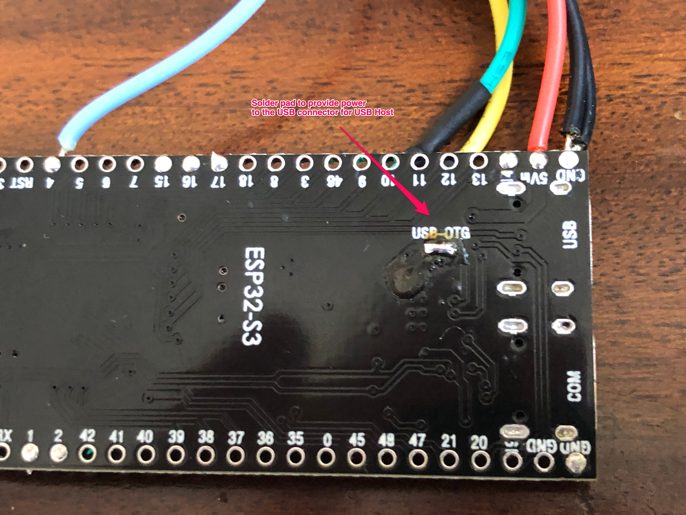
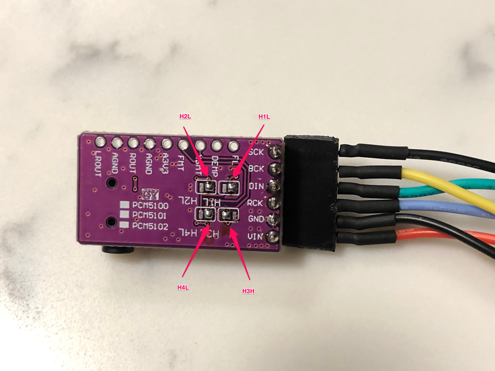
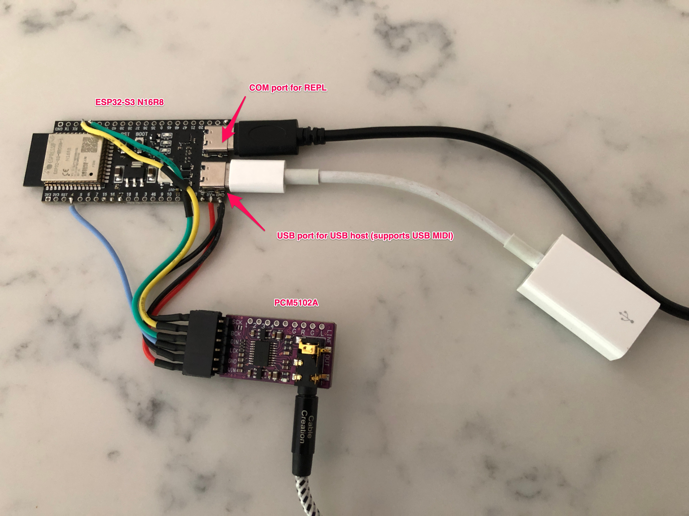

# tulipcc-headless
## How to build and run a Tulip CC without a display or keyboard

Tulip CC is the Tulip Creative Computer an amazing opensource project that is a "portable programmable device for music, graphics, code and writing". It can be found here:

[https://github.com/shorepine/tulipcc](https://github.com/shorepine/tulipcc)

While waiting for my order from Makerfabs I played with the desktop version on MacOS and then wondered if it would be possible to make a stripped down version of the hardware without display or keyboard (i.e. "headless").

There was a discussion about this some time ago which I found here:

[https://github.com/shorepine/tulipcc/discussions/115](https://github.com/shorepine/tulipcc/discussions/115)

I happened to have the appropriate hardware to try this and and was able to get it working.

### Requirements:
- ESP32S3-N16R8 (16 MB flash and 8 MB external RAM) or ESP32S3-N32R8 (32 MB flash and 8 MB RAM). This needs to be a version of the Espressif ESP32-S3-DevKitC-1 with the two USB-C connectors.

- I2S DAC - I used the PDM5102A breakout board

- USB-C to USB-A OTG adapter (optional for USB MIDI)

### Setting up the ESP32 Board

There are two solder pads that need to be jumpered. One is to pass 5V from the USB connectors to the the pin labelled 5Vin which is used to power the DAC. The seconds is to supply power to the USB-C connector labelled USB (the other is COM) for USB host mode (optional).

Hopefully these photos are self explanatory:

 

 

### Setting up the DAC board

Depending on the manufacturer the PCM5102A board most likely needs solder pads jumpered. The boards that I have needed to be configured like in this photo:

 

### Wiring

| ESP32 | PCM5102 | Wire Colour |
| ---------- | --------- | ---------
| 5Vin       | VIN       | Red
| GND        | GND       | Black
| 4          | LCK       | Blue
| 2          | DIN       | Green
| 1          | BCK       | Yellow
| GND        | SCK       | Black

 

### Firmware

The only changes required are to add 2 lines to boot.py but it means that you have to build the firmware yourself.

The instructions for building the firmware are here:

[https://github.com/shorepine/tulipcc/blob/main/docs/tulip_flashing.md](https://github.com/shorepine/tulipcc/blob/main/docs/tulip_flashing.md)

After downloading and before building for the first time find boot.py and add these two lines to it:

`tulip.tfb_log_start()`

`tulip.display_stop()
`

NOTE: you have to use the full build procedure that updates the file system to update boot.py on the device.

I'm using MacOS (Intel based) and found that I had to program the board with the USB-C connector labelled USB and had to put the ESP32 in bootloader mode first (using BOOT + RST buttons). After that you can connect to the computer for the MicroPython REPL with the other USB port (labelled COM) and use the other port for host USB MIDI if wanted.

### Final Note

Most of the Tulip CC examples and documentation assume having a user interface so I am working through the basics and trying to come up with a good workflow. Also my Python is a more than a bit rusty so that adds to the challenge :-)